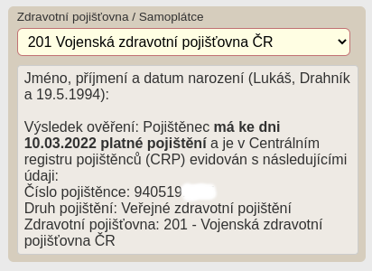
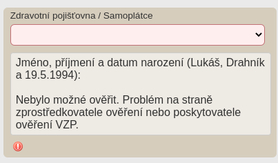
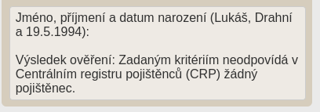

# PRO OC VZP Point





[Rozšíření do Mozilla Firefox](https://addons.mozilla.org/addon/pro-oc-vzp-point)

Rozšíření přidává užitečné funkce za pomoci [VZP Point](https://www.vzp.cz/e-vzp/vzp-point) do modulu [Pacienti COVID-19](https://ereg.ksrzis.cz/Registr/CUDZadanky/VyhledaniPacienta) a [Žádanky testů COVID-19](https://eregpublicsecure.ksrzis.cz/Registr/CUD/Overeni) s cílem usnadnit práci s těmito systémy.

## Zásady ochrany osobních údajů

Osobní informace pacientů podmíněné přihlášením do modulu [Pacienti COVID-19](https://ereg.ksrzis.cz/Registr/CUDZadanky/VyhledaniPacienta) a webové aplikace [Žádanky testů COVID-19](https://eregpublicsecure.ksrzis.cz/Registr/CUD/Overeni) jsou použity pro přidání nových funkcí, které využívají [VZP Point](https://www.vzp.cz/e-vzp/vzp-point). **Žádná data nejsou jakkoliv zpracovávána.**

## Použití

Aktuálně (k 10.3.2022) se nelze k Centrálnímu registru pojištěnců ČR spravovaného [VZP](https://www.vzp.cz) dotazovat podle jména, přijmení a datumu narození jinak než manuálně ve [VZP Point](https://www.vzp.cz/e-vzp/vzp-point). Pro využití tohoto rozšíření je zapotřebí zadat do nastavení vlastní proxy server, který dotaz zproztředkuje, např. [PRO OC VZP Point Proxy](https://github.com/PRO-OC/pro-oc-vzp-point-proxy). Defaultně se body požadavků šifrují pomocí AES knihovny [crypto-js](https://github.com/brix/crypto-js). Toto šifrování lze vypnout v nastavení.

## Změny pro Mozilla Firefox

- Použití manifest souboru s verzí 2 ```manifest.v2.json```
- Odstranění řádku ```importScripts("../lib/crypto-js.min.js");``` ze souboru ```background/background.js``` 

## Žádanky testů COVID-19

- Při vystavování žádanky provádí kontrolu pojištění podle jména, přijmení a datumu narození

## Pacienti COVID-19

- Na detailu profilu provádí kontrolu pojištění podle jména, přijmení a datumu narození (důležité při slučování profilů)
